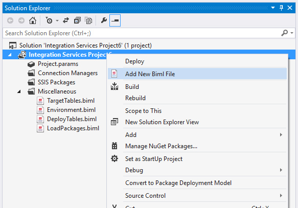
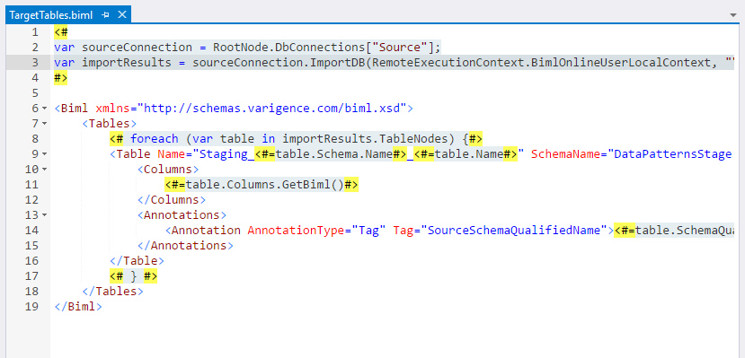
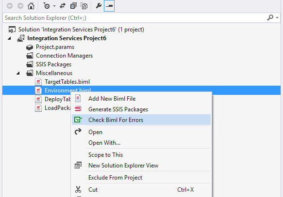

# Add and Edit Biml Files

To add a Biml file to the project, right-click on the project, or on the Data Sources, Data Source Views, or SSIS Packages folders. The context menu will have an **Add New Biml File** menu option. This will add a Biml file to the Miscellaneous folder in the project.

Note: Right-clicking on the Miscellaneous folder will not open a context menu.

After adding a Biml file, double-click to open it in the BimlExpress code editor, which includes syntax highlighting for Biml and BimlScript code nuggets, autocomplete, and error highlighting.

Autocomplete can be opened by pressing **Ctrl+Space** while editing a Biml tag.

After adding Biml code to a file, it can be checked for errors by choosing the **Check Biml for Errors** option from the context menu.

