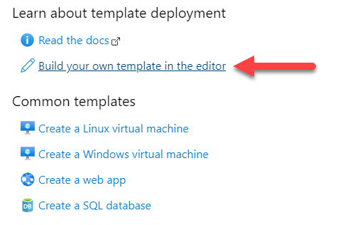

## Deployment through the Azure Portal

For a walkthrough of creating a BimlFlex solution that targets ADF, review the [Synapse ADF Implementation Guide](../implementation-guides/synapse-implementation-introduction.md).

You have generated your Azure Data Factory (ADF) assets, and are ready to deploy. This document will discuss deployment using ARM templates within the Azure Portal. For information on how to deploy using powershell, review our [Powershell Deployment Guide](using-powershell.md).

## Navigate to your Data Factory

1. Go to the [Azure Portal](https://portal.azure.com).

1. Navigate to [Deploy a custom template](https://portal.azure.com/#create/Microsoft.Template).

   

1. Click [Build your own temple in the editor]

    

1. Click [Load File]

   

1. Navigate, within your output folder, to:

`...\output\DataFactories\\<Setting.AzureDataFactoryName>\arm_template.json`

   > <Setting.AzureDataFactoryName> Default = `BimlFlex`

1. Click [Save].

1. Click [Edit parameters].

   

1. Click [Load File].

   

   > Remember the value for the `keyVaultName`.  We will need to update BimlFlex with this value after deployment.

1. Navigate to `...\output\DataFactories\\<Setting.AzureDataFactoryName>\arm_template_parameters.json`.

1. Click [Save].

1. Choose `Resource Group`.

1. Check [I agree to the terms and conditions stated above].

1. Click [Purchase].

1. Wait for Deployment to complete.

Once deployment has completed, you can go to your resource group, and verify that your Data Factory was created and is deployed.

 > Your resource group will be named something like `ADF-<HashKey>` or the `Settings.AzureDataFactoryName`.

