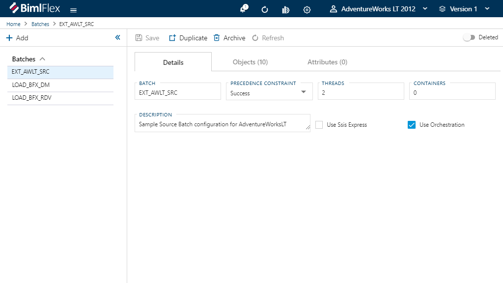
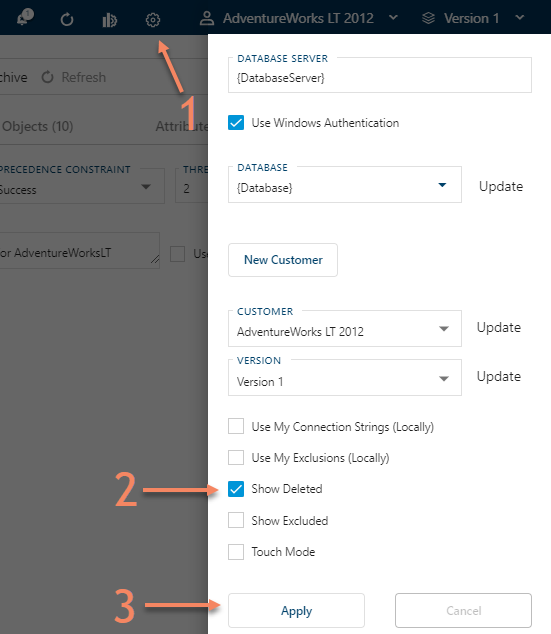

# Batches 

`Batches` group and help define an ETL/ELT workload.  They are uses by `Projects` to set execution grouping.

## Panel Overview

**Batches Panel**  

### Batch Navigation

This area allows for basic navigation and the creation of new `Batches`.

**Batch Navigation Pane**  

//TODO: Create callouts for each number

1. Add/Create a new `Batch`.
1. Collapse/Hide the navigation pane.
1. `Batches` available for selection.  Highlighted `Batch` indicates the `Batch` that is currently selected.

### Action Buttons

[Action Buttons] list the actions available within the currently selected [Tab].  All [Action Buttons] are context specific to the currently selected [Tab].  Functions of each of the [Action Buttons] are outlined in their appropriate section(s) below.

**Tab Action Buttons**  

### Tabs

[Tabs] can be used to switch between maintenance of the select `Batch` or provide multiple views of an associated `Object` or `Attribute`.  

**Tabs**  

#### Tab - Single Form w/Fields or Table

Some [Tabs] only have a single view with either a list of fields of a table with a list of associated entities.  These [Fields] or [Tables] are context dependant and are outlined in the appropriate section(s) below.  Regardless of whether a [Table] or [Field] is displayed, either can be edited from the viewing form.  [Fields] can often be edited by simply clicking in the selected field while a [Table] requires a user to double-click on the value the user wants to edit.

**Single Form**  

#### Tab - Sub-Form w/Tables

When a [Tab] has multiple views that may be used, an oval selector will appear listing out alternative views.  The active view is highlighted and can be changed by clicking another available option.  The alternate views only change what properties of an entity are visible/editable and will not filter, remove or resort the underlining list of entities.  As with a [Single Form], tables values can be edited by double-clicking the desired property.

**Sub-Form w/Views**  

## Details Tab

The [Details Tab] focuses on general batch information and configuration.  This [Tab] is used to define and create the `Batch` itself.

### Details Tab - Action Buttons

  - This will save the currently set of staged changes.  The [Save] button is will only enable if the `Batch` has changes staged and there are no major validation issues with the current `Batch` properties.

  - This will create a duplicate of the selected `Batch`.  A prompt will appear asking for a [New Name] and a new `Batch` will be created using all of the selected `Batch`'s current properties.

  - This will `hard delete` the selected `Batch`.  This will result in the physical removal of the selected record from the metadata database.  The data will no longer be accessible by the BimlFlex app and will require a Database Administrator to restore, if possible.

>[!WARNING]
> Archiving is a permanent removal of the selected entity from it's associated table in the metadata database.  Best practice is to use the [Deleted] flag to `soft delete` a entity, and [Archive] should only be used in the case that you both:
>
> 1. The only fix to the current issue requires the [Archive] of the selected entity.
> 2. The full implications that the removing of the selected entity from the metadata system will cause.

  - This will trigger a refresh of the metadata for the selected `Batch`.

  - This will `soft delete` the currently selected `Batch`.  This will remove the `Batch` from all processing and it will be excluded from all validation.

>[!NOTE]
> A [Deleted] entity can be restored by flipping the [Deleted] flag back to `false`.  To view a [Deleted] entity go to your [BimlFlex Options] (1), enable [Show Deleted] (2) and click [Apply] (3).  This will now allow [Deleted] entities to appear.  Please ensure that the option is disabled again once the deleted member has been restored.  
>
> 

### Details Tab - Fields

[Batch]  
[Precedence Constraint]  
[Threads]  
[Containers]  
[Description]  
[Use Ssis Express]  
[Use Orchestration]  

## Objects Tab

The [Objects Tab] provides quick access to all `Objects` included in the `Batch`.

### Objects Tab - Action Buttons

[Add]  - This will add a new object to the `Batch`.  A [Add Object] 

  - This will save the currently set of staged changes.  The [Save] button is will only enable if any `Object` has changes staged and there are no major validation issues with the current list of `Object` properties.

  - This will `hard delete` the selected `Object`.  This will result in the physical removal of the selected record from the metadata database.  The data will no longer be accessible by the BimlFlex app and will require a Database Administrator to restore, if possible.

  - This will trigger a refresh of the metadata for the selected list of `Objects`.

### Sub-forms and Fields

#### Sub-Form: Overview

[Connection]  
[Object]  
[Short Name]  
[Object Type]  
[Excluded]  
[Exclude Build]  
[Exclude Validation]  
[Not Persistent]  
[Deleted]  

#### Sub-Form: Model Overrides

[Object]  
[Model Type]  
[Model Override Name]  
[Model Override Short Name]  
[Model Grouping]  

#### Sub-Form: Query Overrides

[Object]  
[From Sql]  
[Object Alias]  
[Join Sql]  
[Where Sql]  
[Group By Sql]  
[Override Sql]  

#### Sub-Form: Dependencies

[Object]  
[Depend On Object]  
[Same As Inherited]  
[Use Inherited Name]  
[Inherit From Object]  

## Attributes Tab

The [Attributes Tab] provides a view of any `Configurations` or `Settings` overrides that have been applied to the selected `Batch`.  

>[!NOTE]
> This is exclusive to the `Batch` level.  Additional overrides may be present on any grains higher or lower than the `Batch`.

### Attributes Tab - Action Buttons

[Add]  

[Edit]  

  - This will `hard delete` the selected `Attribute`.  This will result in the physical removal of the selected record from the metadata database.  The data will no longer be accessible by the BimlFlex app and will require a Database Administrator to restore, if possible.

### Attributes Tab - Field Descriptions

[Object]  
[Column]  
[Key]  
[Value]  
[Property]  