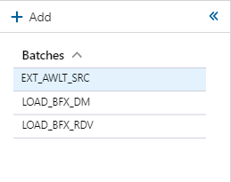
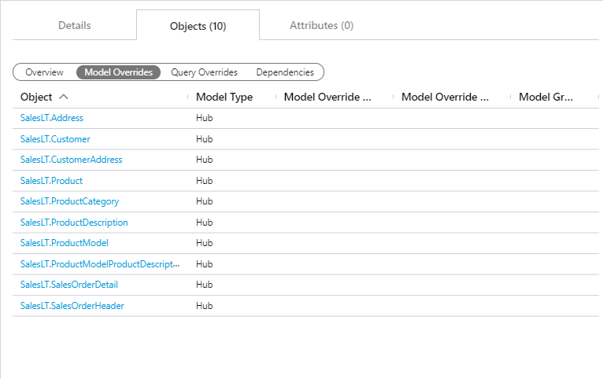

# Batches 

`Batches` group and help define an ETL/ELT workload.  They are uses by `Projects` to set execution grouping.

## Panel Overview

**Batches Panel**  

### Batch Navigation

This area allows for basic navigation and the creation of new `Batches`.

**Batch Navigation Pane**  

//TODO: Create callouts for each number

1. Add/Create a new `Batch`.
1. Collapse/Hide the navigation pane.
1. `Batches` available for selection.  Highlighted `Batch` indicates the `Batch` that is currently selected.

### Action Buttons

[Action Buttons] list the actions available within the currently selected [Tab].  All [Action Buttons] are context specific to the currently selected [Tab].  Functions of each of the [Action Buttons] are outlined in their appropriate section(s) below.
\
**Tab Action Buttons**  

### Tabs

[Tabs] can be used to switch between maintenance of the select `Batch` or provide multiple views of an associated `Object` or `Attribute`.  

**Tabs**  

#### Tab - Single Form w/Fields or Table

Some [Tabs] only have a single view with either a list of fields of a table with a list of associated entities.  These [Fields] or [Tables] are context dependant and are outlined in the appropriate section(s) below.  Regardless of whether a [Table] or [Field] is displayed, either can be edited from the viewing form.  [Fields] can often be edited by simply clicking in the selected field while a [Table] requires a user to double-click on the value the user wants to edit.

**Single Form**  

#### Tab - Sub-Form w/Tables

When a [Tab] has multiple views that may be used, an oval selector will appear listing out alternative views.  The active view is highlighted and can be changed by clicking another available option.  The alternate views only change what properties of an entity are visible/editable and will not filter, remove or resort the underlining list of entities.  As with a [Single Form], tables values can be edited by double-clicking the desired property.

**Sub-Form w/Views**  

## Details Tab

The [Details Tab] focuses on general batch information and configuration.  This [Tab] is used to define and create the `Batch` itself.

### Action Buttons

[Save]  
[Duplicate]  
[Archive]  
[Refresh]  
[Deleted]  

### Fields

[Batch]  
[Precedence Constraint]  
[Threads]  
[Containers]  
[Description]  
[Use Ssis Express]  
[Use Orchestration]  

## Objects Tab

The [Objects Tab] provides quick access to all `Objects` included in the `Batch`.

### Action Buttons

[Add]  
[Save]  
[Refresh]  

### Sub-forms and Fields

#### Sub-Form: Overview

[Connection]  
[Object]  
[Short Name]  
[Object Type]  
[Exlcuded]  
[Exclude Build]  
[Exclude Validation]  
[Not Persistent]  
[Deleted]  

#### Sub-Form: Model Overrides

[Object]  
[Model Type]  
[Model Override Name]  
[Model Override Short Name]  
[Model Grouping]  

#### Sub-Form: Query Overrides

[Object]  
[From Sql]  
[Object Alias]  
[Join Sql]  
[Where Sql]  
[Group By Sql]  
[Override Sql]  

#### Sub-Form: Dependencies

[Object]  
[Depend On Object]  
[Same As Inherited]  
[Use Inherited Name]  
[Inherit From Object]  

## Attributes Tab

The [Attributes Tab] provides a view of any `Configurations` or `Settings` overrides that have been applied to the selected `Batch`.  

>[!NOTE]
> This is exclusive to the `Batch` level.  Additional overrides may be present on any grains higher or lower than the `Batch`.

### Action Buttons

[Add]  

### Field Descriptions

[Object]  
[Column]  
[Key]  
[Value]  
[Property]  