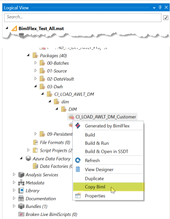
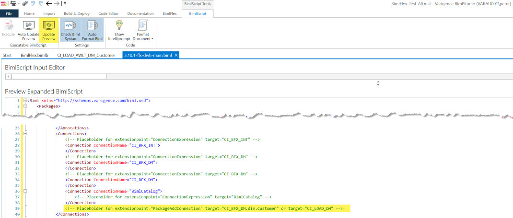

# Extension Points

Extension Points are used to extend the functionality in BimlFlex. It allows injection of source code into the normal patterns and it allows overrides and replacements of code where the default patterns needs additional logic

The Extension Points are created as Biml files in the BimlStudio solution and the BimlFlex ribbon UI provides templates for all the available Extension Points.

## How to find the Extension Point target

Sometimes you want to customize the package and add an **Extension Point** and you require two things, the name and target.

### Option 1

* If you know the **Extension Point** and just need the target you can right-click the Object that you want to apply it too and click `Copy Biml`.

* Paste the `Biml` in `Notepad` or `Notepad ++`. We are using Notepad ++ and have set the language to `XML` to enable highlighting.
* You can now copy either the **Batch** or `ObjectEntity` depending on your extension point scope.

### Option 2

This is a bit more technical and require some knowledge of `Biml`.

1. `Right Click` the Object that you want to apply it too and click `View Designer`.

1. Right Click on the tab with the package name in this case `CI_LOAD_AWLT_DM_Customer` and then click `View in BimlScript Designer`

1. click `Update Preview` on the `BimlScript` tab.
1. In the `Preview Expanded BimlScript` there are `XML` comments with the available `Extension Point` targets.
1. When targetting the parent of an Object-based Extension Point, also set `CustomOutput.ObjectInherit = true;`

