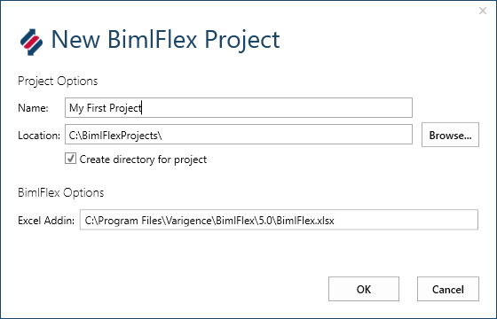
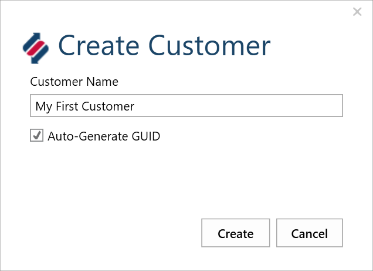

# Initial Configuration

The initial setup of BimlFlex include the steps to set up the full development environment:

* Creating the project
* Connecting to the databases
* Loading the Sample Metadata

that are required for the full BimlFlex framework to work.

Once the BimlFlex installation is completed, it is time to set up the environment for a BimlFlex project.

The development side is focused around the BimlFlex App and tje BimlStudio-based BimlFlex project.

## BimlStudio project

Open the BimlStudio Application and create a new, empty project.

The first time a new installation starts, it requires a License Key. This key is provided as part of the engagement with Varigence.

If a trial key is required, please contact Varigence BimlFlex Support at [support@bimlflex.com](mailto:support@bimlflex.com).

### Video Walkthrough

### Creating the BimlFlex project

From the start page, create a new **BimlFlex Project**

Options for creating a new BimlFlex Project. Place the project in a suitable folder, the folder will contain source code for the project and should be managed through a source control system.

Once the project is created, it is possible to open it from the folder by opening the project file, or by opening the project from BimlStudio.

### Connect to the Metadata Database

The BimlFlex project in BimlStudio communicate with the BimlFlex metadata database.

The databases are created and updated through the BimlFlex installer. It is also possible to set up the databases from the BimlFlex ribbon tab in BimlStudio.

If needed, create BimlFlex databases by clicking Setup BimlFlex.

The default naming convention for the database names can be overridden to identify projects or environments.

To be able to complete this step, the account used to access the database engine needs the necessary rights to create and configure the new databases.

### Creating Customer

The **Customer** entity holds a set of metadata in the metadata database and can be used to identify different projects, versions, customers, variations.

A **Customer** can have multiple versions of the related metadata. An initial Version is created with the Customer. Throughout a project, it is possible to progress through multiple different versions.

It is recommended that the BimlStudio Project and the Metadata Customer has the same name.

## BimlFlex App

Start the BimlFlex App and configure it to connect to the BimlFlex database that was created during the installation.

The BimlFlex app allows easy metadata management and provides features such as metadata import and graphical Data Vault acceleration.

The BimlFlex app has a connection to the BimlFlex Metadata database, the customer and the version.

The BimlFlex App has a Reporting function that can connect to a BimlCatalog database and show execution information.

## Excel Add-in Metadata Editor

The Excel-based Metadata Editor is opened from the BimlFlex Ribbon tab in BimlStudio. The Excel Add-in provides an environment for bulk-editing metadata.

The BimlFlex Excel metadata editor comes with an additional Excel tab in the Ribbon for interacting with BimlFlex. The first step is to open the metadata connection pane and connect to the BimlFlex metadata database.

Once the connection is defined the metadata can be read into Excel. The master data is stored in the database and the working set is cached and displayed in Excel. The data is not updated in real time. It is important to commit changes to the database and to communicate within the development team to synchronise changes to the Metadata.

Retrieve all metadata into Excel by clicking the `Get All Entities` and `Get All Settings` buttons in the Excel BimlFlex Ribbon UI.

Once the metadata entities and settings are refreshed, it is possible to review the metadata, configurations and settings.

## Configuration

This step includes the required and optional configurations available for the BimlFlex framework.

### BimlStudio Project configuration

The BimlStudio project options include settings such as the target SQL Server and SSIS versions and project or package deployments for SSIS. Most of these are optional to change, but the target version and deployment method needs to be correct for the packages to open correctly in Visual Studio and run correctly on the destination SSIS server.

