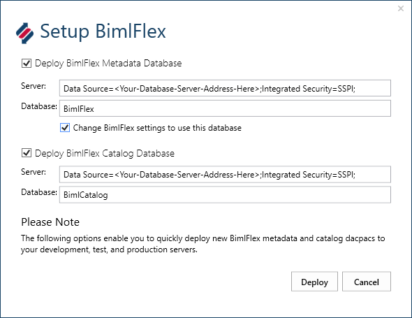
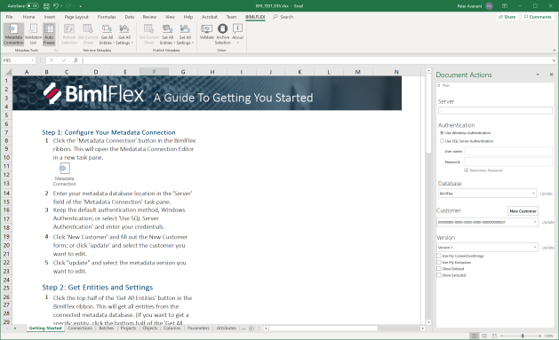
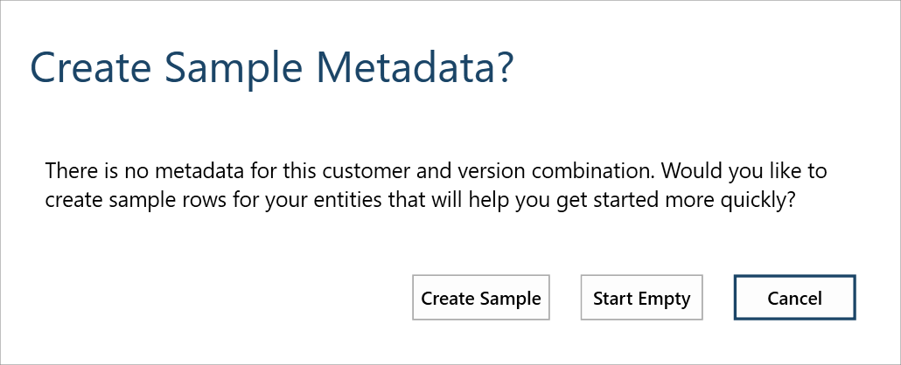
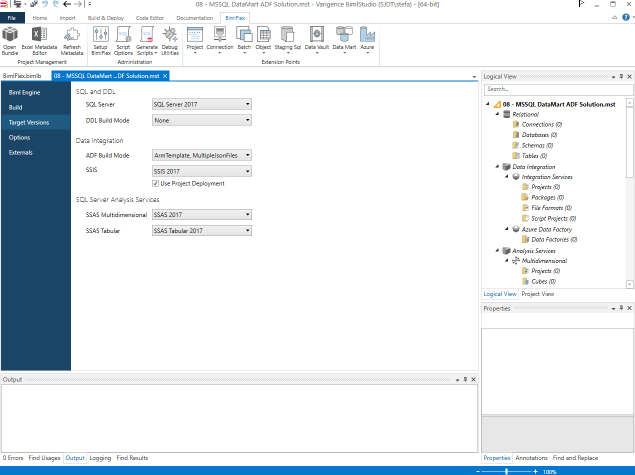

# Initial Setup and Configuration

The setup includes the necessary steps to set up the environments, including:

* the projects
* the databases
* the components

that are required for the full BimlFlex framework to work.

Once the BimlStudio and BimlFlex installations are completed, it is time to set up the environment for a BimlFlex project.

The development side is focused around the BimlStudio-based BimlFlex project. Open the BimlStudio Application and create a new, empty project.

The first time a new installation starts it requires the License Key. This key is provided as part of the engagement with Varigence.

If a trial key is required, please contact Varigence BimlFlex Support at [support@bimlflex.com](mailto:support@bimlflex.com).

## Watch Recordings

### BimlFlex - Initial Configuration

In this session, we go through the initial configuration of the BimlFlex project. We will cover the initial deployment of BimlFlex and BimlCatalog databases, create our first metadata instance.

## Creating the BimlFlex project

From the start page, create a new BimlFlex project

Options for creating a new BimlFlex Project.

Once the project is created, it is possible to open it directly from the folder or by opening the project file from BimlStudio.

### Set up Databases

The next step is to connect to the BimlFlex databases. BimlFlex uses a metadata database and an orchestration catalog database. All metadata generated in BimlFlex is stored in the metadata database. A metadata database can contain many projects (customers) and versions.

The orchestration catalog database contains run-time information about package executions, auditing and logging of any errors encountered.

The databases are created and updated through the BimlFlex installer. It is also possible to set up the databases from the BimlFlex ribbon tab in BimlStudio.

If needed, create BimlFlex databases by clicking Setup BimlFlex.

The default naming convention for the database names can be overridden to identify projects or environments.

To be able to complete this step, the account used to access the database engine needs the necessary rights to create and configure the new databases.

### Setting up a Customer

The Customer entity holds a separate set of metadata in the database and can be used to identify different projects, versions, customers, variations.

A Customer can have multiple versions of the related metadata. An initial Version is created with the Customer. Throughout a project, it is possible to work with multiple different versions.

### Setting Up the Excel Metadata Editor

The Excel-based Metadata Editor is opened from the BimlFlex Ribbon tab in BimlStudio. The editor provides a familiar and productive metadata management environment.

The BimlFlex Excel metadata editor comes with an additional Excel tab in the Ribbon for interacting with BimlFlex. The first step is to open the metadata connection pane and connect to the BimlFlex metadata database (default name BimlFlex).

Once the connection is defined the metadata can be read into Excel. The master data is stored in the database and the working set is cached and displayed in Excel. The data is not updated in real time, so for collaborative projects, it is important to commit changes to the database and keep communicating within the team.

Retrieve all metadata into Excel by clicking the `Get All Entities` and `Get All Settings` buttons in the Excel UI.

The first time an empty customer is opened there is an option to create sample metadata.

This helps guide the first projects and provides a base set of metadata to build on.

Once the metadata entities and settings are refreshed, it is possible to review the sample data and default settings.

## Configuration

This step includes the required and optional configurations available for the BimlFlex framework.

### BimlStudio Project configuration

BimlStudio project options include settings such as the target SQL Server and SSIS versions and project or package deployments for SSIS. Most of these are optional to change, but the target version and deployment method needs to be correct for the packages to run on the destination server.

