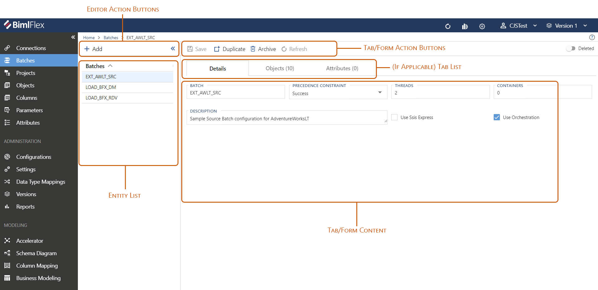
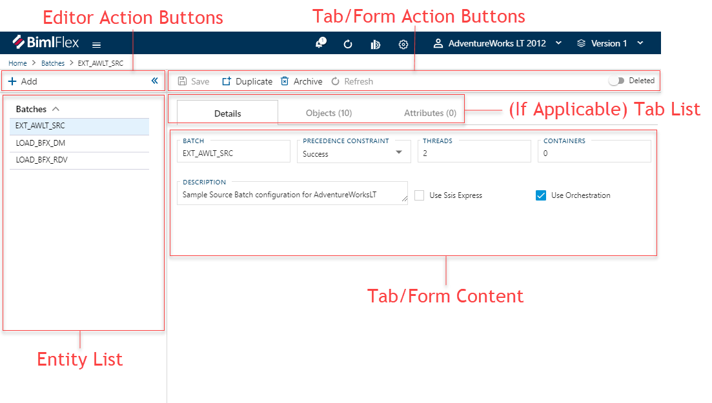
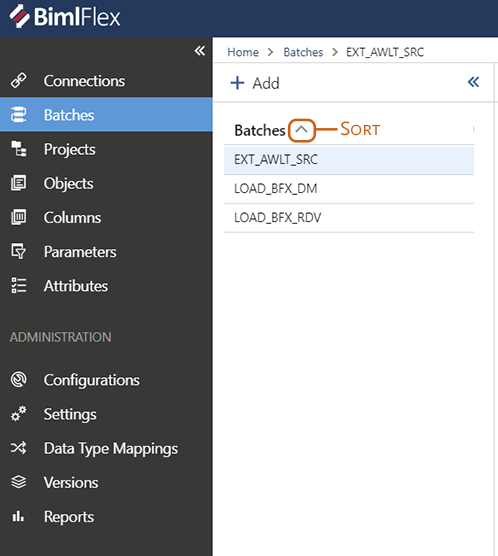
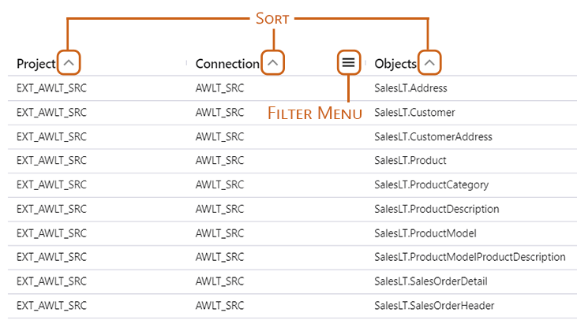
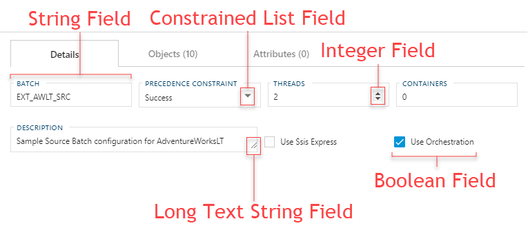
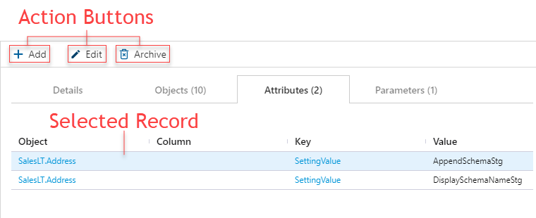
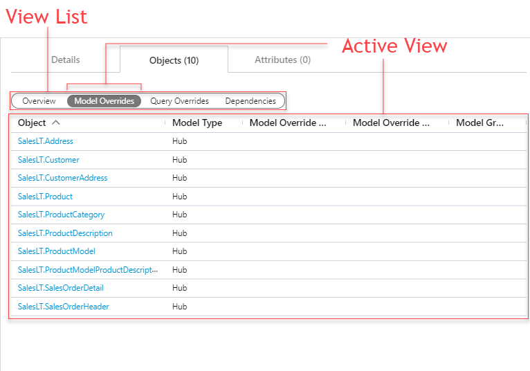
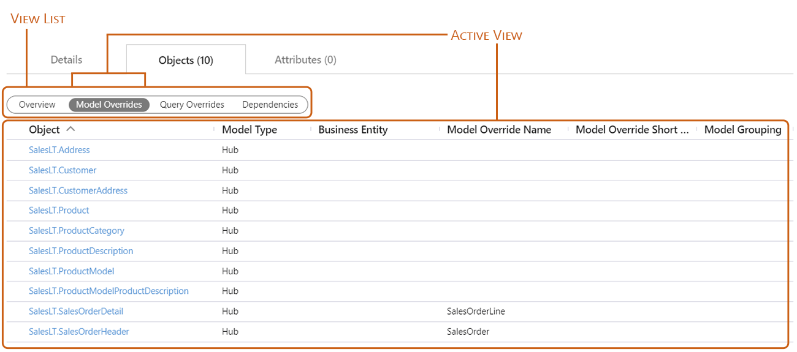
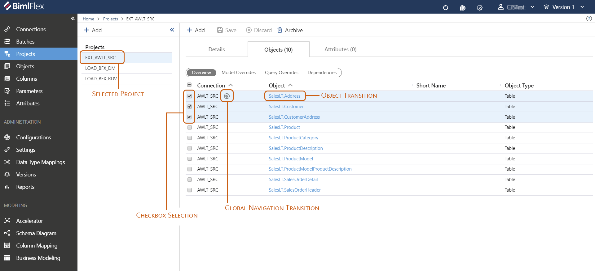

# BimlFlex Tour  

The following sections describe the UI elements that make up an Entity Editor and how the features provide navigation and interaction.  

[!include[BimlFlex Toolbar](_incl-toolbar.md)]

## BimlFlex Menu  

The BimlFlex Menu provides quick navigation to the available editors and modeling tools.  The menu is dynamic and automatically expands and hides based on the current size of the application window.  If the menu is hidden you can use the button annotated below to open.  

**BimlFlex Menu**  

<!--

-->

## BimlFlex Metadata Editor Layout  

The BimlFlex Metadata Editors are provided to give a streamlined and intuitive way to enter and manage your metadata.  The available features may vary from editor to editor but they all use the same layout.  What follows is a quick tour of the various editor elements and how they function.  For detailed information of the available the features reference the relevant documentation for the appropriate editor.  

**Editor Layout**  

<!--
  
-->

## Breadcrumb Navigation Elements  

BimlFlex features a breadcrumb navigation to easily raise your view to a higher context when needed.  The entities shown in the breadcrumbs will depend on the entity that is being viewed and the navigation path that was used.  Elements are provided to select either the associated parent entity or to navigate without filter context to a parent element editor.  

**Breadcrumb Navigation Elements**  

<!--
  
-->

## Editor Action Buttons  

The Editor Action Buttons provide quick access to common useful features managing the collection of the associated entity type.  As noted previously, available actions can vary from editor to editor but the ability to add and collapse or expand are generally ubiquitous across them all.  

**Editor Action Buttons**  

|Icon|Action|Description|
|-|-|-|-|
| 

 | Add | **Add** will create a new entity. |
| 

 | Validate | This will trigger validation to be run.  It will display  if all validation passes, or  if there errors and add those errors to the global validation list. |
| 

 | Clear Filters | *Clear Filters* will remove any filter context that was previously entered of passed through.  This is handy when you want to manage **Settings** and **Parameters** across multiple **Projects**. |
| 

 | Collapse | *Collapse* will cycle through the the various supported modes the Entity List can have.  Options are Full Panel, Split Panels, and Hidden. |
| 

 | Expand | *Expand* will cycle through the the various supported modes the Entity List can have.  Options are Hidden, Split Panels, and Full Panel. |

## Entity List  

The entity list enumerates all of the available entities for the current filter context.  When and editor is opened through the BimlFlex Menu the default action is to open without and filter context, exposing all the the given entity type.  When an editor is opened via a [Navigation Transition] generally a context for the entities **Project** or **Connection** is applied, but ultimately may vary based on the transitional context.  The amount and availability of the the columns is determined by the editor being used.  

**Entity List - Single Column**  

<!--

-->

<!--
**Entity List - Multi Column**  

-->
|Icon|Action|Description|
|-|-|-|-|
| 

 | Sort Descending | When shown the column is currently sorting in descending order.  Click to switch to ascending order. |
| 

 | Sort Ascending | When shown the column is currently sorting in ascending order.  Click to switch to descending order. |

> [!TIP]
> All of the columns support the ability for filters but the button is hidden by default.  To show the button mouse over the field you would like to filter.  

## Tab and Form Action Buttons  

The **Tab and From Action Buttons** list the actions available within the currently selected entity.  All action buttons are context specific to the currently selected tab if tab navigation function is provided the the selected editor.  As the list to large to enumerate and goes past the scope of the guide, refer to the document for the appropriate editor to view all availed actions along with their descriptions.  Many buttons feature context sensitivity and only enable/disable when appropriate.  

**Tab and Form Action Buttons Example**  

<!--
  
-->
## Tab List  

If the selected editor supports them, tabs are used to switch between managing of the selected parent entity (Details Tab) and managing of the associated child entities.  

**Tab List Example**  

<!--
  
-->
## Tab and Form Content  

The Tab and Form Content area is where all the metadata for the associated entity is represented.  Layouts can vary depending on the editor being used but generally falls into one of 3 categories: Field List, Table, or Multiple Views.  

### Field List  

A Field List provides a series of context sensitive fields.  BimlFlex will dynamically hide and expose fields depending on the current properties of the selected entity.  Additionally BimlFlex provides field level validations with the ability to highlight misconfigured metadata.  

**Fields Content**  

<!--
  
-->

#### Long Text String Field  

The long text string field can be resized by dragging the adjustment corner in the field. It also include an editor dialog with enhanced features for when a lot of information needs to be entered. The editor dialog is accessed by clicking the  icon when the long text string field is in focus.  

The editor dialog will open with the text from the long text string field. The editor dialog features include:  

- Text suggestions based on entered text
- Tab auto complete
- Scroll preview
- Line numbers

When changes are complete, click the **Ok** button to keep the changes that have been made. Click **Cancel** to discard the changes that have been made and close the editor.  

### Table  

Table content is provided when an entity features some complex logic and should be edited through a dialog box.  New items can be entered entered via the  **Add** button.  Existing items can be edited by selecting a row and then using the  **Edit** button.  The same filter as sort functions that are provided on the **Entity List** are available on these content types.  

**Table Content**  
<!--
  
-->

### Multiple Views  

When **Multiple Views** are used, an oval selector will appear listing out alternative views.  The active view is highlighted and can be changed by clicking another available option.  The alternate views only change what properties of an entity are visible/editable and will not filter, remove or resort the underlining list of entities.  Values can be edited by double-clicking the desired property.  

<!--
**Multiple Views Content**  
  
-->

## Navigational Transitions and Checkbox Selection

BimlFlex features the ability to navigate directly to another entity whenever it is referenced from a calling table or form.
Click the light blue value will allow you to navigate directly to the the object referenced in the associated editor.
Click the 'Compass' icon for global navigation to any entity within the project.
Every navigable entity within the BimlFlex application will have such an icon.

BimlFlex now features a checkbox UI feature for any list of items being viewed.
Highlight over a single item, and a checkbox will appear on the left.
If selected, checkboxes will appear for all items in the list. 
Selecting the checkbox at the top of the list will select/deselect all items.
Having multiple items selected will allow the user to bulk-archive as many items as are currently selected. 
With multiple items selected, users may select `Integration Key` from the **Objects** Action Bar to enter the Generate Derived Integration Key with the desired items already selected.

<!--
  
-->

