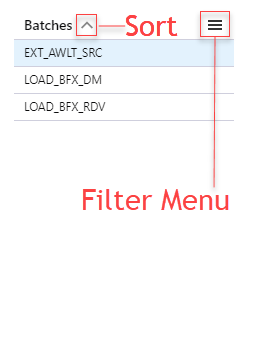
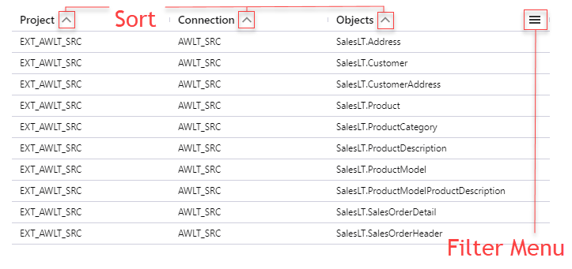
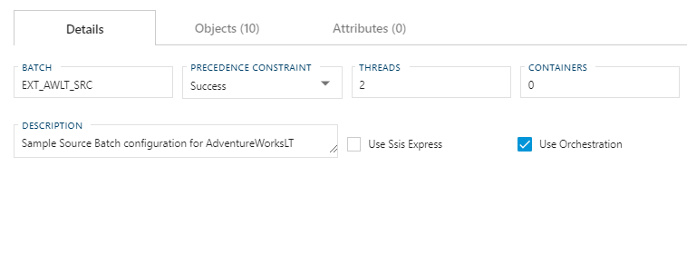
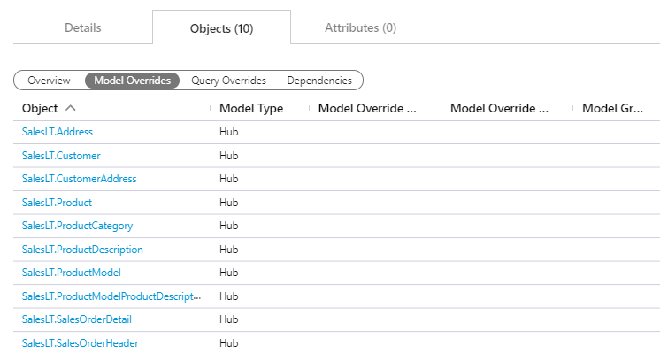

# BimlFlex Tour  

The following sections describe the UI elements that make up an Entity Editor and how the features provided navigation and interaction.

## Staring Window

[//]: # (TODO: Maybe snip a starting window?)

## BimlFlex Title Bar

[//]: # (TODO: Button Intro)

**BimlFlex Title Bar**  

|Icon|Action|Description|Relevant Article|
|-|-|-|-|
||BimlFlex Dashboard|Navigate to BimlFlex Dashboard.||
|

|BimlFlex Menu|Only appears in window size prevents the BimlFlex menu from expanding.  Click to open the BimlFlex Menu.||
|

|Notifications (White)|Notifications generated by the applications appear here.||
|

|Validations (Red)|Global errors in metadata appear here.||
|

|Refresh Metadata|Connect to the database and requery all metadata for the selected `Customer` and `Version`.||
|

|Configure Reporting Catalog|Create or select the BimlCatalog connection to be used for reports.||
|

|Settings|Configure database settings.  This is where you can set the server and database that is used for the recording of BimlFlex metadata.  Additional properties such as [Show Deleted] and [Show Excluded] also reside here.||
|

|Customer|Displays the currently selected BimlFlex `Customer`.  Click to view a list of the other available BimlFlex `Customers`.||
|

|Version|Displays the currently selected BimlFlex `Version`.  Click to view a list of the other available BimlFlex `Versions`.||

[//]: # (TODO: Icon for Hamburger)

## BimlFlex Menu

The BimlFlex Menu provide quick navigation to the available editors and modeling tools.  The menu is dynamic and automatically expands and hides based on the current size of the application window.  If the menu is hidden you can use the button annotated below to open.

**BimlFlex Menu**  

## BimlFlex Metadata Editor Navigation

The BimlFlex Metadata Editors are provided to give a streamlined and intuitive way to enter and manage your metadata.  The available features may vary from editor to editor but they all use the same layout.  What follows is a quick tour of the various editor elements and how they function.  For detailed information of the available the features reference the relevant documentation for the appropriate editor.

**Editor Layout**  

### Breadcrumb Navigation Elements

BimlFlex features a breadcrumb navigation to easily raise your view to a higher context when needed.  The entities shown in the breadcrumbs will depend on the entity that is being viewed and the navigation path that was used.  Elements are provided to select either the associated parent entity or to navigate without filter context to a parent element editor.

**Breadcrumb Navigation Elements**  

### Editor Action Buttons

The Editor Action Buttons provide quick access to common useful features managing the collection of the associated entity type.  As noted previously, available actions can vary from editor to editor but the ability to [Add] and [Collapse/Expand] are generally ubiquitous across them all.

**Editor Action Buttons**  

|Icon|Action|Description|
|-|-|-|-|
|

|Add|[Add] will create a new entity to be added to the [Entity List].  Once the required information is entered click [Save Action Button] in the [Tab/Form Action Buttons] to add the new entity to the list.|
|

|Validate|Perform a validation pass across the associated entity.|
|

|Clear Filters|[Clear Filters] will remove any filter context that was previously entered of passed through.  This is handy when you want to manage `Setttings` and `Paramaters` across multiple `Projects`.|
|

|Collapse|[Collapse] will cycle through the the various supported modes the Entity List can have.  Options are [Full Panel], [Split Panels] and [Hidden].|
|

|Expand|[Expand] will cycle through the the various supported modes the Entity List can have.  Options are [Hidden], [Split Panels] and [Full Panel].|

### Entity List

The entity list enumerates all of the available entities for the current filter context.  When and editor is opened through the BimlFlex Menu the default action is to open without and filter context, exposing all the the given entity type.  When an editor is opened via a [Navigation Transition] generally a context for the entities `Project` or `Connection` is applied, but ultimately may vary based on the transitional context.  The amount and availability of the the columns is determined by the editor being used.

**Entity List - Single Column**  

**Entity List - Multi Column**  

|Icon|Action|Description|
|-|-|-|-|
|

|Filter||
|

|Sort Descending|When shown the column is currently sorting in descending order.  Click to switch to ascending order.|
|

|Sort Ascending|When shown the column is currently sorting in ascending order.  Click to switch to descending order.|

> [!TIP]
> All of the columns support the ability for filters but the button is hiden by default.  To show the button mouse over the field you would like to filter.

### Tab/Form Action Buttons

The [Tab/From Action Buttons] list the actions available within the currently selected entity.  All [Action Buttons] are context specific to the currently selected [Tab] if tab navigation function is provided the the selected editor.  As the list to large to enumerate and goes past the scope of the guide, refer to the document for the appropriate editor to view all availed actions along with their descriptions.

**Tab/Form Action Buttons Example**  

### Tab List

If the selected editor supports them, [Tabs] are used to switch between managing of the selected parent entity (Details Tab) and managing of the associated child entities. 
  
**Tab List Example**  

### Tab/Form Content

The [Tab/Form Content] area is where all the metadata for the associated entity is represented.  Layouts can vary depending on the editor being used but generally falls into one of 3 categories: [Field List], [Table], or [Multiple Views].

#### Field List

A [Field List] provides a series of context sensitive fields.  BimlFlex will dynamically hide and expose fields depending on the current properties of the selected entity.  Additionally BimlFlex provides field level validations with the ability to highlight misconfigured metadata.

**Fields**  

#### Table

#### Multiple Views

When [Multiple Views] are used, an oval selector will appear listing out alternative views.  The active view is highlighted and can be changed by clicking another available option.  The alternate views only change what properties of an entity are visible/editable and will not filter, remove or resort the underlining list of entities.  Values can be edited by double-clicking the desired property.

**Multiple Views**  

