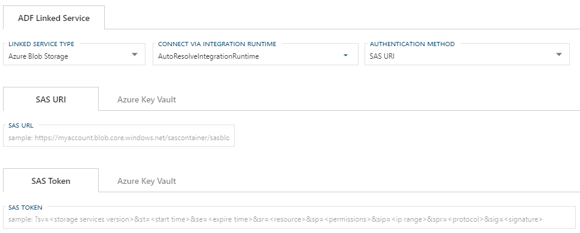

# Configuring an ADF Linked Service Connection for Azure Blob Storage

> [!NOTE]
> For information on how to enable a connection for use with linked services, see [Configuring a Linked Service Connection](create-linked-service-connection.md).

[//]: # (TODO List of stages, connection types, and system types that can use Azure Blob Storage)

After selecting `Azure Blob Storage` from the Linked Service Type dropdown, the form required for creating an Azure Blob Storage Linked Service will appear.

## Required Fields

**Common Required Fields**

Most required fields for an Azure Blob Storage Linked Service connection depend on the Authentication Method used. There are some fields that are required regardless of Authentication Method.

These common required fields are:

+ [Connect via Integration Runtime](#connect-via-integration-runtime)
+ [Authentication Method](#authentication-method)

Common optional fields are:

+ [Additional Connection String Properties](#additional-connection-string-properties)

**Authentication Method Dependent Required Fields**

The remaining field requirements are dependent on Authentication Method.

**Required fields for [Account Key Authentication](#account-key)**:

+ [Connection String](#account-key-connection-string) (or [Azure Key Vault](create-linked-service-connection.md))
  + Storage Account Name
  + Storage Account Key (or [Azure Key Vault](create-linked-service-connection.md))

Optional fields:

+ Endpoint Suffix

**Required fields for [SAS URI Authentication](#sas-uri)**:

+ SAS URL (or [Azure Key Vault](create-linked-service-connection.md))
  + SAS Token (or [Azure Key Vault](create-linked-service-connection.md))

**Required fields for [Service Principal Authentication](#service-principal)**:

+ Tenant (Tenant ID)
+ Service Principal ID (Application ID)
+ Service Principal Key (Application Key) (or [Azure Key Vault](create-linked-service-connection.md))

**Required fields for [Managed Identity Authentication](#managed-identity)**:

+ Service Endpoint

### Connect via Integration Runtime

Connect via Integration Runtime is required for an Azure Blob Storage Linked Service connection. The default value is `AutoResolveIntegrationRuntime`. To use a custom runtime, type the name into the editable dropdown or select from the Azure Integration Runtimes saved in BimlFlex settings. When a custom value is saved in the linked service form, it will be added to the custom integration runtimes. The custom values that appear in this dropdown can be maintained in Settings under Azure - AzureIntegrationRuntime.

### Authentication Method

The Azure Blob Storage Linked Service connection can use SQL Authentication, Managed Identity, or Service Principal. When a key vault is used in place of a Connection String, SQL Authentication details should be stored in the Connection String key vault and will not be required in the BimlFlex form.
If [Managed Identity](#managed-identity) is used, no authentication will be required in the BimlFlex Linked Service form.
For [Service Principal Authentication](#service-principal), Service Principal ID, Tenant, and Service Principal Key are required.

#### Account Key

Account Key authorization requires a [Connection String](#account-key-connection-string) that contains a Storage Account Name, a Storage Account Key or [Azure Key Vault](create-linked-service-connection.md), and optionally an Endpoint Suffix.

#### Account Key Connection String

A connection to an Azure Blob Storage with Account Key authorization requires a connection string. The required properties for the connection string are Fully Qualified Domain Name, Database Name, User Name, and Password. The Linked Service connection form will provide text boxes for these values and will use them to construct the connections string.

> [!TIP]
> It is suggested that [Azure Key Vault](linked-service-azure-key-vault.md) be used in place of manually entering Connection String details.

#### SAS URI

Shared Access Signature authentication required an SAS URL or Azure Key Vault. When manually entering the SAS URL, an SAS Token will aslo be required. The SAS Token can also be replaced by an Azure Key Vault. For more information, see the [Shared access signature authentication for Azure Blob Storage documentation](https://docs.microsoft.com/en-us/azure/data-factory/connector-azure-blob-storage#shared-access-signature-authentication).

> [!TIP]
> It is suggested that [Azure Key Vault](linked-service-azure-key-vault.md) be used in place of manually entering the SAS URL and SAS Token.

#### Service Principal

To use Service Principal authentication, an Azure Active Directory application must be set up in your Azure portal as descibled in the [Microsoft documentation for Blob Storage Service Principal Authentication](https://docs.microsoft.com/en-us/azure/data-factory/connector-azure-blob-storage#service-principal-authentication). The Service Principal (Application) ID, Service Principal (Application) Key, and Tenant ID will be required in the Blob Storage Linked Service form.

> [!TIP]
> It is suggested that [Azure Key Vault](linked-service-azure-key-vault.md) be used in place of a Service Principal Key.

#### Managed Identity

To use Managed Identity for authentication with Azure Blob Storage, one must be set up in Azure as described in the [Microsoft documentation for Azure Blob Storage Managed Identities](https://docs.microsoft.com/en-us/azure/data-factory/connector-azure-blob-storage#managed-identity). When using Managed Identity a Service Endpoint is required.

#### Additional Connection String Properties

Any additional properties entered here will be included in the Connection String. These properties should be entered the same way you want them to appear in the connection string and separated by a semicolon, e.g. `key=value;secondKey=secondValue`.

Values entered in the Additional Connection String Properties textbox will be maintained when changing linked service types. If a required property from one service type does not have a corresponding text box in the newly selected linked service type, it will appear as an additional property.

### Azure Data Factory Linked Service Additional Information

For additional information on ADF Blob Storage Linked Service and its connection requirements see the [Azure Data Factory Blob Storage Connector documentation](https://docs.microsoft.com/en-us/azure/data-factory/connector-azure-blob-storage).
