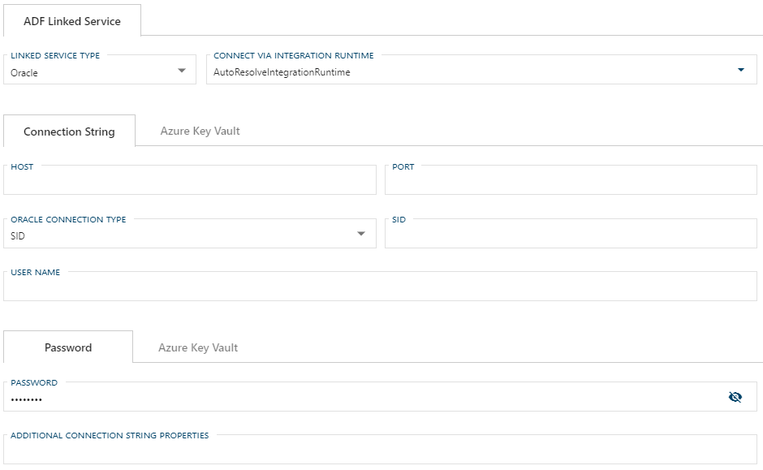

# Configuring an ADF Linked Service Connection for Oracle

> [!NOTE]
> For information on how to enable a connection for use with linked services, see [Configuring a Linked Service Connection](create-linked-service-connection.md).

[//]: # (TODO List of stages, connection types, and system types that can use Oracle)

After selecting `Oracle` from the Linked Service Type dropdown, the form required for creating an Oracle Linked Service will appear.

### Required Fields

The required fields are:

+ [Connect via Integration Runtime](#connect-via-integration-runtime)
+ [Connection String](#connection-string) (or [Azure Key Vault](create-linked-service-connection.md))
  + Host
  + [Oracle Connection Type](#oracle-connection-type)
  + [SID](#oracle-sid)
  + [Service Name](#oracle-service-name)
  + User Name
  + [Password](#password) (or [Azure Key Vault](create-linked-service-connection.md))

Optional fields are:

+ Port
+ [Additional Connection String Properties](#additional-connection-string-properties)

#### Connect via Integration Runtime

Connect via Integration Runtime is required for an Oracle Linked Service connection. The default value is `AutoResolveIntgrationRuntime`. To use a custom runtime, type the name into the editable dropdown or select from the Azure Integration Runtimes saved in BimlFlex settings. The custom values that appear in this dropdown can be maintained in Settings under Azure - AzureIntegrationRuntime.

#### Connection String

A connection to an Oracle linked service requires a Connection String. The required properties for the Connection String are Host, Port, Oracle Connection Type, Service Name, SID, User Name, and Password. The Linked Service connection form will provide text boxes for these values and will use them to construct the connections string.

> [!TIP]
> It is suggested that [Azure Key Vault](linked-service-azure-key-vault.md) be used in place of manually entering Connection String details.

#### Oracle Connection Type

The Oracle Linked Service connection can use requires a connection type. The Oracle Connection Type can be SID or Service Name. The default Oracle Connection Type is SID, which will require an SID to be entered. When a key vault is used in place of manually entering Connection String details, Oracle Connection Type information should be stored in the Connection String key vault and will not be required in the BimlFlex Linked Service form.

#### Oracle SID

SID is required when using an Oracle Connection Type of SID, which is the default. The value entered will be used to construct the Connection String

#### Oracle Service Name

Oracle Service Name is required when using an Oracle Connection Type of Service Name. The value entered will be used to construct the Connection String

#### Password

Password will be used by the Linked Service form for authentication with the Oracle Linked Service. Password is required - except when using Azure Key Vault in place of a manually entering a Connection String.

> [!TIP]
> It is suggested that [Azure Key Vault](linked-service-azure-key-vault.md) be used in place of manually entering the password.

#### Additional Connection String Properties

Any additional properties entered here will be included in the Connection String. These properties should be entered the same way you want them to appear in the Connection String and separated by a semicolon, e.g. `key=value;secondKey=secondValue`.

Values entered in the Additional Connection String Properties textbox will be maintained when changing linked service types. If a required property from one service type does not have a corresponding text box in the newly selected linked service type, it will appear as an additional propertie.

### Azure Data Factory Linked Services Additional Information

For additional information on ADF Linked Service types and their connection requirements see the [Azure Data Factory Oracle Connector documentation](https://docs.microsoft.com/en-us/azure/data-factory/connector-oracle).
