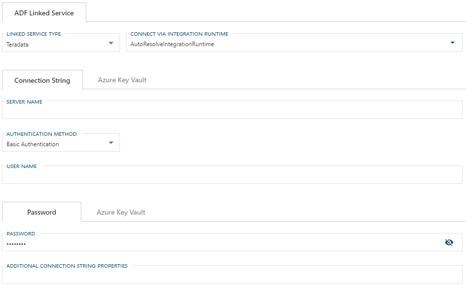

# Configuring an ADF Linked Service Connection for Teradata

> [!NOTE]
> For information on how to enable a connection for use with linked services, see [Configuring a Linked Service Connection](create-linked-service-connection.md).

[//]: # (TODO List of stages, connection types, and system types that can use Teradata)

After selecting `Teradata` from the Linked Service Type dropdown, the form required for creating a Teradata Linked Service will appear.

## Required Fields

The required fields are:

- [Configuring an ADF Linked Service Connection for Teradata](#configuring-an-adf-linked-service-connection-for-teradata)
  - [Required Fields](#required-fields)
    - [Connect via Integration Runtime](#connect-via-integration-runtime)
    - [Connection String](#connection-string)
    - [Authentication Method](#authentication-method)
    - [Password](#password)
    - [Additional Connection String Properties](#additional-connection-string-properties)
  - [Azure Data Factory Linked Services Additional Information](#azure-data-factory-linked-services-additional-information)

Optional fields are:

+ [Additional Connection String Properties](#additional-connection-string-properties)

### Connect via Integration Runtime

Connect via Integration Runtime is required for a Teradata Linked Service connection. The default value is `AutoResolveIntegrationRuntime`. To use a custom runtime, type the name into the editable dropdown or select from the Azure Integration Runtimes saved in BimlFlex settings. The custom values that appear in this dropdown can be maintained in Settings under Azure - AzureIntegrationRuntime.

### Connection String

A connection to a Teradata linked service requires a Connection String. The required properties for the Connection String are Server Name, Database Name, User Name, and Password. The Linked Service connection form will provide text boxes for these values and will use them to construct the connections string.

> [!TIP]
> It is suggested that [Azure Key Vault](linked-service-azure-key-vault.md) be used in place of manually entering Connection String details.

### Authentication Method

The Teradata Linked Service connection can use Basic Authentication or Windows Authentication. When a key vault is used in place of a Connection String, Basic Authentication details should be stored in the Connection String key vault and will not be required in the BimlFlex Linked Service form. If Windows Authentication is used, User Name and Password are still required.

### Password

Password will be used by the Linked Service form for SQL Authentication or Windows Authentication with the Teradata Linked Service. Password is required - except when using SQL Authentication with Azure Key Vault in place of a manually entering a Connection String.

> [!TIP]
> It is suggested that [Azure Key Vault](linked-service-azure-key-vault.md) be used in place of manually entering the password.

### Additional Connection String Properties

Any additional properties entered here will be included in the Connection String. These properties should be entered the same way you want them to appear in the Connection String and separated by a semicolon, e.g. `key=value;secondKey=secondValue`.

Values entered in the Additional Connection String Properties textbox will be maintained when changing linked service types. If a required property from one service type does not have a corresponding text box in the newly selected linked service type, it will appear as an additional property.

## Azure Data Factory Linked Services Additional Information

For additional information on ADF Linked Service types and their connection requirements see the [Azure Data Factory Teradata Connector documentation](https://docs.microsoft.com/en-us/azure/data-factory/connector-teradata).
