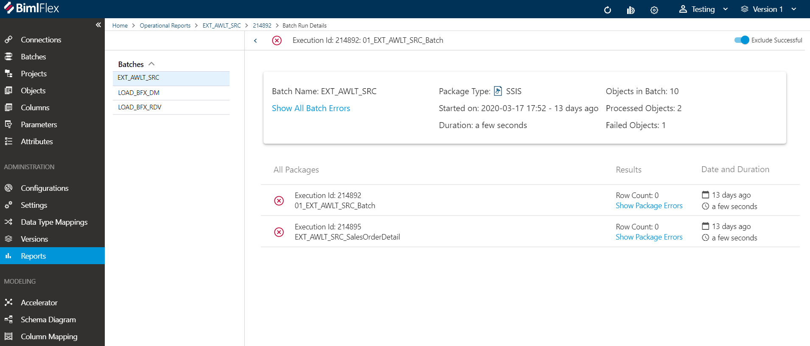

# Operational Reporting

Operational Reporting screens allow users to see the status of their package runs at a high level and to drill down into details and view errors in failing packages. 

The reporting screens leverage the execution logging which is built into BimlFlex package runs. The package execution details are logged to a BimlCatalog database and this data is aggregated for reporting.

## Configuring Operational Reporting

The Operational Reporting BimlCatalog is set up on a per-customer basis and is only required once per customer.

Create BimlCatalog connections for each environment by providing the Name and Connection String.

## Reporting Screens

If there is reporting data for the **Batches** and **Projects** in the currently selected version the Dashboard will display a summary view.

The reporting screens are broken up into three views of the data:

* The top-level summary view will show the latest execution details for each batch.
* The second level shows the 5 most recent execution runs for a specific batch.
* The third level shows the package details and errors (if any) for a specific execution batch and its child packages

Level 1 - Latest execution details for each batch

Level 2 - 5 most recent execution runs for a specific batch

Level 3 - details of specific execution batch and its child packages

### Lookup Execution Id

The *Execution Id* lookup field is available in the First Level screen. It can be used to go straight to the package execution details if the execution id is known. It may also be called audit id in some packages. If the *Execution Id* points to a batch, then all the batch and child information will be available. If it points to a child package, then only that package information will be available on the details screen.
