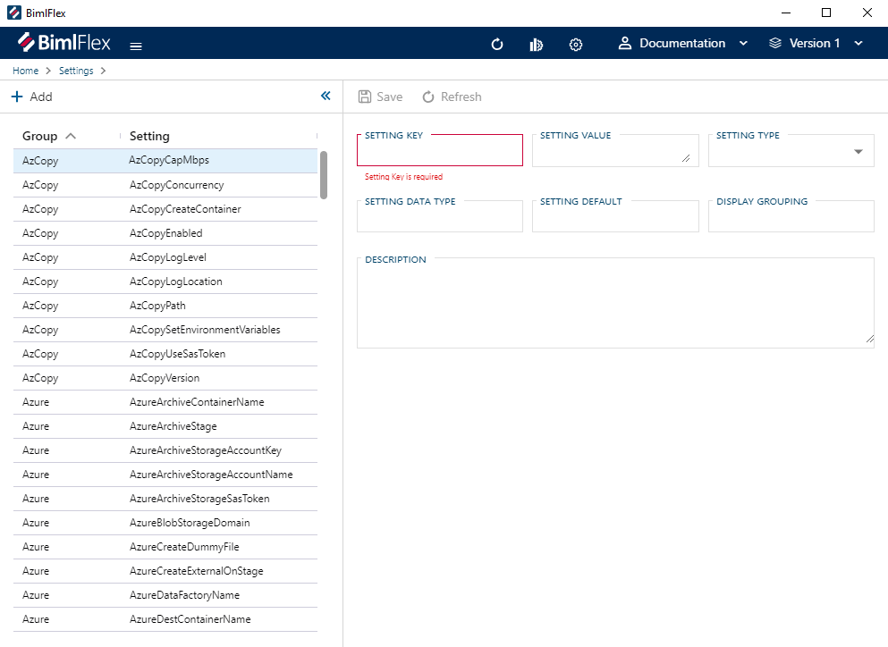
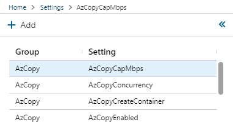
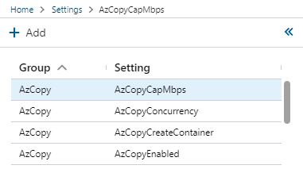
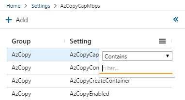

# Settings

The `Settings` module is used to manage metadata and framework settings in the BimlFlex App. By changing settings, the produced artifacts can adapt to specific requirements for file locations, naming conventions, data conventions etc. Align these settings with the organizations best practices and environmental requirements.

 `Settings` can be found under Administration in the application menu.

> [!TIP]
> The [Setting Reference Document](../reference-documentation/metadata-settings.md) serves as a complete guide for all settings available in the BimlFlex App.

## Settings Navigation List

All settings are listed in the settings navigation pane on the left side of the window. Settings are listed by Group and Setting Name. For ease of navigation, settings can be sorted or filtered by both Group and Setting Name.

### Settings List Sorting

To sort the settings navigation list, click on either the Group or Setting Name column header. The list of settings will be sorted in ascending order. Click the column header a second time to sort in descending order; and a third time to restore default sorting.

### Settings List Filtering

`Settings` can be filterd on both Group and Setting Name. To filter settings, hover over either the Group or Setting Name column header and click the menu icon, then enter the text you would like to filter by.

`Settings` can be filtered by text using a few methods. Use the dropdown in the filter menu to change the method used.

### Settings Navigation List Buttons

The Setting Navigation List buttons are located at the top of the Settings Navigation pane.

|Icon|Action|Description|
|-|-|-|
|

|Add Action|[Add] will create a blank `Settings` form for adding a custom setting. This should not be used to [Override a Setting](#override-a-setting).|
|

|Collapse Action|[Collapse] will hide the [Settings Navigation Pane].|
|

|Expand Action|[Expand] will reveal the [Settings Navigation Pane] after it has been hidden.|

## Command Bar Buttons

The buttons in the command bar allow actions to be taken on the setting that is active in the form.

|Icon|Action|Description|
|-|-|-|
|

|Save|This will save any changes displayed in the Settings form.  The [Save] button is only enabled if there are changes in the form.|
|

|Refresh|This will refresh the currently displayed `Setting`. Any pending changes will be removed.|

## Setting Form

The `Settings` form is used to manage all `Settings`. The fields in the form are defined in this table along with the validation rules.

|Field|Description|Validation Rules|
|-|-|-|
|Setting Key|The Setting Key is used as a unique name for the setting.|Setting Key is required. Setting Key must be unique.|
|Setting Value|The Setting Value defines the value applied to the associated Setting Key. The expanded editor can be used with Setting Value.||
|Setting Type|The Setting Type defines the type of data stored in Setting Value. Setting Type can be JSON, SQL, or Text.||
|Setting Data Type|||
|Setting Default|The Setting Default is the default value for the Setting.||
|Display Grouping|Display Grouping is the name of the setting group that the setting belongs to.||
|Description|The description is used to define the purpose and use of the Setting. The expanded editor can be used with Description.||

## Setting Overrides

`Setting Overrides` are used to override Setting Values. Setting Overrides can be added and referenced in the Settings form. All overrides applied to the Setting are listed in the Overrides section of the form. 

Clicking the links in the Overrides table will navigate to the item listed. To edit or delete the Setting Override, click the value in the Key column.

Setting Overrides are saved in BimlFlex as `Attributes`. The [Attributes Documentation](attributes.md) provides information on `Attributes` and how to manage them.

### Add a Setting Override

To add a setting override, click  Add in the top right of the Overrides section and fill out the Add Attribute form.

[!include[Add Attribute Dialog](_dialog-add-attribute.md)]

The Attribute fields are used as the Setting Override as defined in this table.
|Attribute field Name|Setting Field Name|Description|
|-|-|-|
|Attribute Type||Defines the scope for when the override is applied.|
|Attribute||Defines the Setting field that will be overridden.|
|Attribute Value|Setting Key|The Setting Key for the Setting that is being overridden.|
|Attribute Property|Setting Value|The override for the Setting field defined in Attribute.|
|Description||Description of the Setting Override|

### Edit or Delete a Setting Override

`Setting Overrides` are managed as `Attributes` in BimlFlex. To manage a setting override, click the value in the Key column of the Overrides table. The [Attributes Documentation](attributes.md) provides information on `Attributes` and how to manage them.
