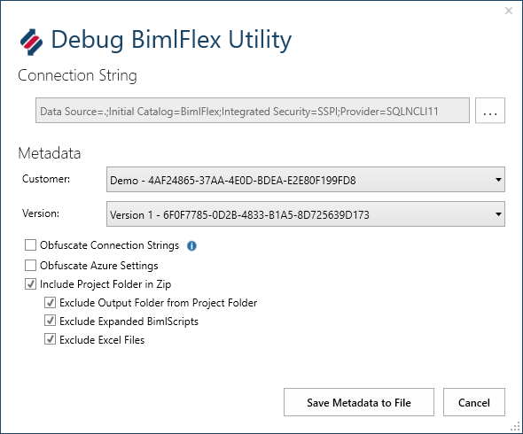

# BimlFlex Debug Utilities

Use the `Debug Utilities` function to create a metadata and project file to send to Varigence BimlFlex support. This might be required in certain scenarios where the support team requires the project metadata and project files and extension points to be able to answer any questions.

To minimize the potential waiting period, and if possible, always include the metadata debug when opening a BimlFlex support case.

Access the `Debug BimlFlex Utility` dialog through the `Debug Utilities` button in the BimlFlex Ribbon tab in BimlStudio. It will connect to the current projects BimlFlex metadata database.

Choose the relevant Customer and Version.

Check the `Include Project Folder in Zip` to also add the project files and extension points to the generated archive file.

Check the Obfuscate options to obfuscate keys and passwords from the database connections and settings.

Remove any other sensitive information before sending through email. Contact the BimlFlex enterprise support team if a secure upload link is needed due to size or security concerns.

Saving the metadata to file creates a zip file that can be sent to the BimlFlex enterprise support team.