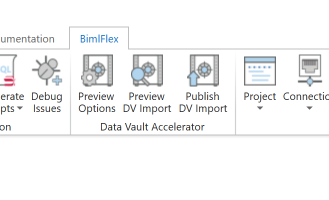
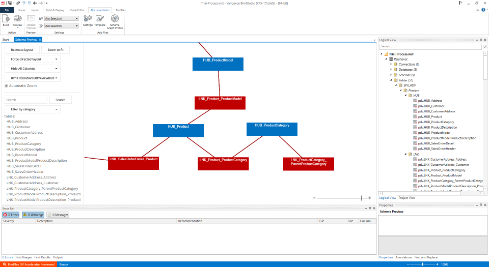
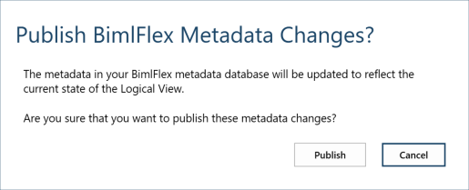

# Accelerating the Raw Data Vault Layer

## Supporting Videos

## Supporting BimlFlex Documentation

* [Data Vault Accelerator](../user-guide/data-vault-accelerator.md)

## Data Vault Acceleration

BimlFlex provides a Data Vault Accelerator that creates Data Vault objects from the defined source metadata.

Data Vault acceleration can be performed once the Enterprise Logical Model, the source data model and corresponding Data Vault model has been created.

The Data Vault acceleration uses the source metadata and its defined relationships to create a Raw Data Vault layer. Based on this metadata, BimlFlex will automatically create the required Data Vault structures and the source to target mappings in the metadata repository.

The accelerator first creates a preview of the Data Vault artefacts so that the model can be reviewed and refined through the normal modeling and development process.

In the trial process, a Unit of Work was updated for the ProductModelProductDescription link table, the preview illustrates that this will be generated as a 3-way link as expected. The attributes for the Product source table was also prepared to be split across 3 Satellites. The preview shows the Product Hub and the expected Satellites.

When the preview matches the model expectations, it is published to the metadata repository.

The new metadata can be reviewed in the Excel metadata editor. The Data Vault objects have been created and the source objects have Source to Target Mappings applied.

Once the metadata has been refreshed in BimlStudio and in the Excel based metadata management solution, it can be built and implemented, or further refined.

Since the staging table structures have been updated, and new Data Vault tables have been added, regenerate the create table scripts and run them on the database server.

Rebuild the SSIS Projects from BimlStudio. The Data Vault load project is a separate project to the Source to Staging Project, with its own Batch package. First open and run the Source to staging Batch - since the tables have been recreated, they first need to be loaded with data from the source. Once there is data in the staging tables, run the Data Vault Load batch in the Data Vault load project. The source table data will be loaded to the Data Vault tables and once completed the Data Vault layer is populated with the source data.

## Detailed Steps

The following detailed steps walks through the acceleration of the Raw Data Vault Layer:

### Configuring the Accelerator

To start the acceleration process, configure the Data Vault Accelerator to the record source, connection and project used. This is done through the Data Vault Accelerator group of buttons in the BimlFlex Ribbon in BimlStudio.

Click the `Preview Options` button and configure the accelerator.

For the trial this is:

* Record Source: `AWLT`
* Connection: `BFX_RDV`
* Project `LOAD_BFX_RDV`

### Previewing the Acceleration result

Click the preview button to generate a preview of the Data Vault.

The corresponding preview tables will be visible in the preview schema in the BimlStudio logical view.

The accelerated Data Vault schema can be visualized and reviewed using the schema visualization tool in the documentation tab.

* Click Preview in the Documentation tab, choose Database Schema Diagram.
* In the generated diagram type, change from `Default` to `BimlFlexDataVaultPreview` or `BimlFlexDataVaultPreviewBackbone` to filter the schema to the preview. The backbone option only include Hubs and Links so that the Core Business Concept and Unit Of Work parts of the model can be more easily reviewed. The preview also include Satellites. 

Review the previewed model and compare it with the Enterprise Logical Model.

The trial process introduced a 3-way link for the `ProductModelProductDescription` source. The `LNK_ProductModelProductDescription` will have 3 Hubs attached, including the derived `HUB_Culture`. The trial also included 3 Satellites for the `HUB_Product`.

If changes are required:

* Disable the preview in BimlStudio
* Update the model information in the BimlFlex Excel based metadata editor
* Push any updates to the repository
* Refresh the metadata in BimlStudio
* recreate the preview using the new metadata

### Publishing the Acceleration result

Once the preview model meets requirements, publish the results to the Metadata Repository by clicking the publish button.

Once the accelerated entities are published they are available in the Metadata Repository and visible in both BimlStudio and BimlFlex Excel-based metadata editor.

### Refreshing the metadata in Excel to review the Data Vault

Switch to the Excel-based metadata editor and click the `Get All Entities` button to read the accelerated entities into the Excel sheets.

The Objects and Columns sheets are now populated with the accelerated objects. The existing source metadata has been updated with target tables and columns representing the source to target mappings of the data from the source to the Data Vault layer.

### Building the new solution

BimlStudio will automatically refresh the metadata once the preview objects are published to the repository. The logical view in BimlStudio is updated to reflect the new metadata. In the `Relational` node the new Data Vault tables are visible. In the `Data Integration`, `Integration Services` node the new project, batch and load packages are visible.

To enable the build of the new project, start by creating the tables.

Use the `Generate Scripts`, `Create Table Script` function to generate the required create table script.

The new Data Vault tables and database are included. The existing Staging tables are updated to include any derived keys needed for Link relationships. By default, these keys are not persisted, so the Persistent Staging tables will be the same.

Execute the new create table script to drop and create all tables.

Once the tables are available, build the SSIS projects using BimlStudio's `Build` function. Note that the Data Vault Load project is in a separate Project to the Source to staging project.

The Data Vault keys are derived in to the staging area so the existing Source to Staging packages have been rebuilt and updated to derive them as needed. Since new data is required and the tables have been recreated, rerun the source to staging project by executing the `EXT_AWLT_Batch.dtsx` package. This will populate the staging tables with data for the Data Vault load.

Open the Data Vault load project in a compatible version of Visual Studio and review the packages. Execute the `LOAD_BFX_RDV_Batch.dtsx` package to load the Data Vault from the staging tables. Once completed, the Data Vault will contain data.

Review the loaded data in the Data Vault.